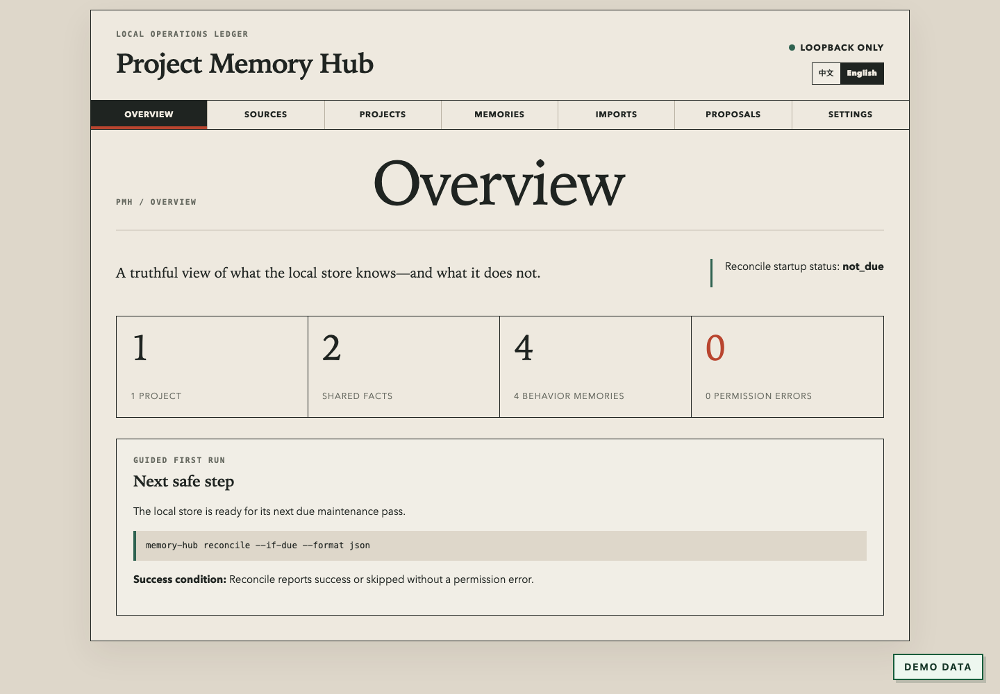

[English](README.md)

**0.2.1 · Public Beta 候选版 · 尚未发布**

# Project Memory Hub（项目记忆中枢）

面向 Codex 本地会话和用户主动提供的 ChatGPT 导出包，提供本机优先、按模型隔离的项目记忆。

Project Memory Hub 把可观察的开发结果整理成下一次任务可直接使用的短简报。它在 Mac 本机
运行，按项目、来源和精确模型隔离行为记忆，也不会把模型隐藏的思维链伪装成可恢复的数据。
它的目标不是保存越多越好，而是让下一次开发先看到当前状态、已经证明有效的验证方法和仍需
处理的问题，从而减少反复阅读整个项目和重复尝试失败方案所消耗的上下文。



## 为什么使用 Project Memory Hub

- **本机优先。** 配置、SQLite 数据、访问凭据和备份保存在私有本机运行目录中；应用不要求
  嵌入服务、外部向量数据库或额外的模型 API Key。
- **严格隔离。** 行为记忆在检索前按 `project_id + source_agent + model_id` 选择，因此一个
  来源或模型不会悄悄继承另一个来源或模型的工作习惯。
- **可验证记忆。** 系统记录显式结果、决策、失败尝试、验证命令、风险、遗留问题和可复用
  教训。Codex 主动 capture 在本地会话适配器核验来源前只会保持待核验状态。
- **审批后变更。** 共享规则和改进提案都需要本地复核。获批代码提案只会在隔离分支和私有
  临时 worktree 中应用；工具不会替你 merge 或 push。

## 五分钟快速开始

### 环境要求

- macOS
- Python 3.11 或 Python 3.12
- [uv](https://docs.astral.sh/uv/)
- 本仓库普通、稳定的本地克隆，而不是临时 `.worktrees` checkout

安装本地包并初始化私有运行目录：

```bash
uv tool install .
memory-hub version
memory-hub init --format json
```

`memory-hub version` 应输出 `0.2.1`；初始化应返回 `{"status":"initialized"}`。

无需编辑 TOML 即可完成首次配置。下面的示例只保留一个已审查根目录，同时继续启用 Codex
和 ChatGPT：

```bash
memory-hub setup --project-root "$HOME/Documents" --source codex --source chatgpt --complete --format json
```

不带配置选项运行 `memory-hub setup --format json` 时，只会零写入地检查状态。Setup 按
项目 + 来源 + 精确模型 ID 保持行为记忆隔离。它不会编辑 Codex automation TOML；创建或
修复每日任务仍需在授权的 Codex 宿主中明确执行。

先预览项目发现结果，不写项目注册表；确认候选后再正式注册：

```bash
memory-hub discover --dry-run --format json
memory-hub discover --format json
memory-hub doctor --format json
```

成功的项目发现会报告 `status: "ok"`。可选宿主集成缺失时，doctor 可能返回非阻断的
`warn`；出现 `fail` 时应先排查再继续。

非 dry-run 的 discover 会注册该次发现返回的全部候选，并不是逐项目勾选器。正式应用前，
应先调整已配置根目录，直到 dry-run 清单全部可以接受。

审查受管 `AGENTS.md` 变更后再连接 Codex：

```bash
PMH_LAUNCHER="$(realpath "$(command -v memory-hub)")"
PMH_PYTHON="$(dirname "$PMH_LAUNCHER")/python"
test -x "$PMH_PYTHON"
codex mcp add project-memory-hub -- \
  "$PMH_PYTHON" -m project_memory_hub.integration.mcp_broker
codex mcp get project-memory-hub
memory-hub integrate agents install --dry-run --format json
memory-hub integrate agents install --format json
```

在 `~/.codex/config.toml` 生成的 `[mcp_servers.project-memory-hub]` 表中，只放行并预先批准
broker 的两个有界工具，同时保留原来的全局审批策略：

```toml
enabled_tools = ["capture_pending_v1", "reconcile_if_due_v1"]
default_tools_approval_mode = "prompt"

[mcp_servers.project-memory-hub.tools.capture_pending_v1]
approval_mode = "approve"

[mcp_servers.project-memory-hub.tools.reconcile_if_due_v1]
approval_mode = "approve"
```

首次注册 broker 后重启 Codex。受管区块会要求 Codex 在 Git 项目的实质工作前通过最小权限
MCP broker reconcile 并执行只读 recall，在完成并验证一个工作单元后再通过 broker capture；
简单问答和非项目聊天不会触发这套流程。继续使用普通的“工作区写入”沙箱即可，无需完全访问。

需要检查本机状态时，启动仅监听回环地址的控制台：

```bash
memory-hub serve --host 127.0.0.1 --port 8765
```

浏览器认证引导、ChatGPT 导入流程、成功判据和安全移除步骤见
[入门指南](docs/getting-started.md)。

## 兼容性

### 来源

| 来源 | 能力 | Public Beta 状态 |
| --- | --- | --- |
| Codex | 增量读取本地 JSONL 并核验 capture | `Supported` |
| ChatGPT | 导入用户主动选择的官方 export ZIP | `Supported`；仅手动导入 |
| Trae | 有界安装/访问检查及可选结构检查 | `Read-only probe`；行为导入锁定 |
| WorkBuddy | 有界安装和目录访问检查 | `Read-only probe`；行为导入锁定 |
| Zcode | 有界安装和目录访问检查 | `Read-only probe`；行为导入锁定 |
| QoderWork | 有界安装和目录访问检查 | `Read-only probe`；行为导入锁定 |
| Claude Code | 有界安装和目录访问检查 | `Read-only probe`；行为导入锁定 |

只有 Codex 和 ChatGPT 是已注册的导入来源。可选来源探针只在电脑所有者明确请求时运行；
reconcile、doctor 和每日自动任务都不会调用这些探针。

如果 ChatGPT 导出缺少可用的模型标识，记录会进入
`source_agent=chatgpt + model_id=unknown`。所有这类记录会共享这个回退命名空间，因此它们
仍与其他来源隔离，但不具备精确模型隔离；复用前应人工复核。

### 平台与运行环境

| 组件 | 状态 | 说明 |
| --- | --- | --- |
| macOS | `Supported` | 主要本机运行环境和阻断式发布环境 |
| Linux | `Experimental` | 非阻断兼容目标，不属于正式支持的发布平台 |
| Windows | `Unsupported` | 没有受支持的运行环境或发布产物 |
| Python 3.11 | `Supported` | 包声明的运行版本 |
| Python 3.12 | `Supported` | 包声明的运行版本 |
| Chromium | `Verified` | 浏览器行为由 Playwright Chromium 测试覆盖 |
| Safari 和 Firefox | 未核验 | 本 Beta 不作兼容承诺 |

Python 3.11 和 3.12 的支持声明必须以 macOS 上隔离用户目录、全新环境安装已构建 wheel 的
smoke 结果为证据。在真实仓库运行出现前，不声称 GitHub 托管 CI 已通过；Linux 始终是明确
非阻断的实验目标。

## 它会记住什么

共享项目事实可包括有界的 Git 状态、根级清单、包脚本、测试配置、README/AGENTS 索引和
文件树统计。行为记忆只保存结构化、经过脱敏的字段，例如结果、显式决策、失败尝试、已验证
方法、偏好、风险、遗留问题和可复用教训。

任务开始前，recall 会生成最多 800 tokens 的相关性简报。它优先保留当前状态、直接相关的
验证命令和未完成事项，而不是重放整个项目历史。

项目事实与行为经验采用不同共享规则：可由文件、Git、测试或用户复核的项目事实可以在同一
项目内共享；行为经验默认只能由同一项目、同一来源和同一精确模型读取。若要把一条私有经验
提升为共享规则，必须先提出 promotion，再在控制台中单独审批。长期不活跃项目可以分阶段
压缩，原结构化条目会转为 `cold`，不会为了节省空间而被悄悄删除。

## 隐私边界与非目标

Project Memory Hub 不会：

- 把 Codex 或 ChatGPT 原始对话正文复制进记忆数据库；
- 推测人格、私人推理过程或隐藏思维链；
- 扫描整个主目录，或主动读取 `.env`、私钥、凭据、依赖目录和构建产物；
- 抓取浏览器、复用账号 Cookie，或持续同步 ChatGPT 账号；
- 把运行数据上传到外部记忆、嵌入或模型服务；
- 把可选来源探针变成行为导入；
- 未经审批修改被扫描项目，或替用户决定 merge、push 提案；
- 提供多人云端知识库，也不会充当抵御同一 macOS 账号下恶意进程的沙箱。

本地 Web 服务器只接受回环地址绑定。bootstrap token 单独以私有权限保存；认证成功后会从
URL 中移除，并换成带 CSRF 防护的 HttpOnly 本地会话。

这里的“本机优先”并不等于操作系统级隔离：如果另一个进程已经拥有当前 macOS 用户的文件
读取权限，它仍可能读取数据库或访问令牌。Archive 和 Delete 也是数据库生命周期操作，不承诺
立即覆盖 SQLite 页面、WAL、系统快照或既有备份中的字节。需要彻底清理时，应停止所有写入者
并按照运维文档执行完整卸载，而不是手工删除数据库记录来制造已经清理的假象。

威胁模型、删除语义和已知限制见[安全架构](docs/security.md)。怀疑存在漏洞时，请按照
[SECURITY.md](SECURITY.md) 的私密流程报告，不要在含敏感数据的公开 issue 中披露。

## 工作原理

### 本机数据流


项目发现和事实扫描与行为导入相互独立。reconcile 在单实例锁和幂等 checkpoint 保护下，
依次处理安全重试、Codex 增量、用户提供的 ChatGPT 导入、待核验 capture、长期压缩和基于
健康状态的提案。

### 严格模型隔离


共享事实必须是可观察的项目事实。私有行为记忆不会先跨项目、来源或精确模型搜索后再删除
不匹配结果；命名空间本身就是候选选择条件。

### 审批式改进


健康分析可以产生提案，但提案创建、批准、应用、回滚、merge 和发布始终是不同步骤。
Project Memory Hub 会停在隔离 `codex/` 分支上的可复核本地提交。

完整 capture marker、显式问题解决状态机、重试行为和组件边界见
[架构文档](docs/architecture.md)。

## 合成截图

所有公开截图都从独立合成运行目录生成，并显示醒目的 `DEMO DATA` 标识。不得用真实
Projects 页面或个人运行数据生成公开资产。

- [Sources：正式导入与锁定的只读探针](docs/assets/screenshots/sources.png)
- [Memories：精确选择项目、来源和模型](docs/assets/screenshots/memories.png)
- [仓库社交预览](docs/assets/social-preview.png)

## 文档

- [入门指南](docs/getting-started.md)
- [架构](docs/architecture.md)
- [安全架构](docs/security.md)
- [运维与恢复](docs/operations.md)
- [发布准备](docs/releasing.md)
- [安全政策](SECURITY.md)
- [贡献指南](CONTRIBUTING.md)
- [行为准则](CODE_OF_CONDUCT.md)
- [变更记录](CHANGELOG.md)

## 许可证

Project Memory Hub 使用 [Apache License 2.0](LICENSE)。
