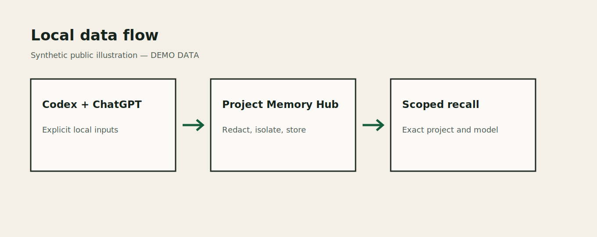
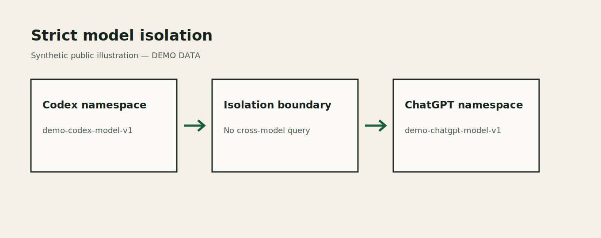
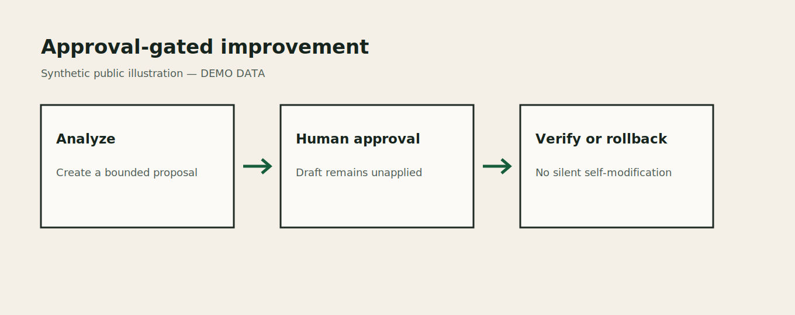

# Architecture

[README](../README.md) · [简体中文](../README.zh-CN.md) ·
[Getting started](getting-started.md) · [Security](security.md) ·
[Operations](operations.md)

Project Memory Hub is a local, single-user memory layer for AI-assisted software development. Its
design separates observable project facts from source- and model-specific behavior, verifies
provenance before trusting direct Codex capture, and keeps every repository change behind an
approval boundary.

## Design goals

- Reduce repeated project rediscovery with a relevance-ranked brief capped at 800 tokens.
- Preserve explicit outcomes, decisions, failed attempts, verification methods, risks, open issues,
  preferences, and reusable lessons.
- Share only observable project facts across models working on the same project.
- Isolate behavior memory before candidate retrieval, not after a cross-model search.
- Continue safe projects and records when another bounded source or project is unavailable.
- Make retries, imports, and reconcile idempotent through durable checkpoints and fingerprints.
- Keep promotion, proposal application, merge, push, and publication as separate user decisions.

The product is not a raw conversation archive, a chain-of-thought recorder, a hosted team service,
or a general-purpose sandbox for hostile processes running as the same macOS user.

## Component map



| Component | Responsibility |
| --- | --- |
| Discovery | Find bounded project candidates under configured roots and report access problems |
| Project facts | Observe bounded Git state, root manifests, scripts, documentation indexes, tests, and tree statistics |
| Codex adapter | Incrementally parse local Codex JSONL lifecycles and independently verify task completion and model provenance |
| ChatGPT adapter | Validate and import a user-selected official export ZIP, then match conversations without guessing |
| Capture service | Canonicalize, redact, fingerprint, stage, and verify structured behavior memory |
| Recall service | Retrieve only the exact namespace, rank relevant entries, and construct a bounded prompt brief |
| Reconcile service | Order discovery, facts, retries, source ingestion, verification, compaction, and health analysis under one lock |
| Control panel and CLI | Expose local review and explicit mutation boundaries without changing the data model |
| Improvement service | Create reviewable proposals and apply an approved patch in an isolated Git worktree |

SQLite is the durable local store. The Web interface and CLI call the same service/repository layer;
the Web server is not a second memory implementation.

## Facts and behavior are different data classes

Shared project facts are observations that another model can verify from the same project: current
Git state, manifests, package scripts, test configuration, README or AGENTS headings, Graphify
metadata, and bounded tree counts. A fact can also be an explicitly approved shared rule.

Behavior memory describes how a particular source/model pair worked: an outcome, explicit decision,
failed attempt, verified method, preference, risk, open issue, retrospective, or reusable lesson.
Behavior content is private to its namespace unless the owner creates and then separately approves a
promotion.

The approved promotion path is the project shared-memory layer; no third automatic cross-model
behavior store is needed. Approval writes an `approved_shared_rule` project fact whose evidence
retains the source agent, exact model ID, promotion ID, and local approval actor. Recall can share
that fact across models while the source behavior row remains namespace-private. Unapproved behavior
is never searched across models.

## Strict namespace isolation



Every behavior query is scoped by:

```text
project_id + source_agent + model_id
```

The SQL candidate query receives all three identifiers. The system does not search a mixed pool and
then remove foreign source/model rows. Equal model labels reported by different products remain
separate because `source_agent` is part of the key. If a ChatGPT export has no safe model slug, its
records use `source_agent=chatgpt + model_id=unknown`. Multiple unlabeled or unsafe model slugs share
that fallback namespace; the system never guesses a more precise model identity. This fallback is
source-isolated, but callers must not treat it as proof of precise model isolation.

The project ID is based on a registered canonical path identity, not merely a display name or Git
remote fingerprint. Path replacement, relink, or registry-generation drift causes the affected
transaction to fail closed. Persisted macOS records tolerate an APFS device-number renumbering only
at the same canonical path when the directory inode is unchanged; the next discovery observation
refreshes the stored device number. In-process before/after snapshots still require an exact
device/inode tuple.

## Codex verification chain

The managed workflow resolves current task metadata before recall or capture:

1. `codex-context` receives the task cwd.
2. It cross-checks `CODEX_THREAD_ID` against bounded local Codex session metadata.
3. It returns the exact `source_agent=codex`, exact `model_id`, and a local correlation ID.
4. Ordinary recall revalidates that namespace independently before querying memory.
5. Managed Codex submits capture only through the narrow MCP broker. The broker stores it as
   `pending_verification`, not as trusted memory; managed tasks never fall back to direct CLI writes.
6. A later Codex adapter pass reads the real completed lifecycle and validates project, namespace,
   structured content fingerprint, and verification window.
7. Only a match promotes the pending declaration into verified behavior memory. In the same
   transaction, the pending row moves to payload-free history and its structured body is removed
   from the active queue.

The returned `source_record_id` deduplicates local pending capture. It does not grant trust and cannot
let one task claim another task's model identity. Owner-only manual recall requires the local access
token through stdin; managed Codex guidance must never use that override as a fallback.

`pending_captures` is an active quarantine, not an unbounded audit log. Its 512-per-project and
10,000-global limits count only rows still awaiting verification. Verified, expired, and rejected
rows retain content-free provenance metadata in `pending_capture_history`, which has a 50,000-row
global hard limit and deterministically removes the oldest `(finalized_at, pending_id)` entries.
Normal verification, forensic pending recovery, and expiry all finalize through the same database
transaction, so trusted memory writes, history insertion, and active-payload deletion commit or roll
back together.

The local pending correlation and the adapter's trusted source record are deliberately separate.
After an adapter actually matches a pending row, schema v12 binds that local correlation to the new
trusted `source_refs` row in the same transaction. This preserves exact duplicate detection after
bounded history eviction without treating equal content from another task as the same claim, and an
ordinary replay of an older trusted source cannot bind a later pending row.

Deferred Codex recovery is also parser-policy scoped. Schema v13 stores the exact policy SHA-256
with each content-free locator; replay checks it before opening the source, canonical grouping and
receipt hashes include it, and a policy mismatch fails closed. The migration cannot safely infer a
policy for older locators, so it invalidates those rows and records a dedicated Codex reconcile
catch-up marker. The marker remains due across adapter failure or a disabled Codex source and is
cleared with compare-and-delete semantics only after a successful Codex pass. The checkpoint policy
mismatch then restarts the bounded source scan and creates fresh locators only under the current
parser policy.

## Capture marker contract

To give the adapter an exact, bounded task-completion summary, the final assistant message places one
versioned block after all user-facing prose:

```text
<!-- project-memory-hub:capture:v1:start -->
Objective: <verified objective>
Outcome: <verified outcome>
Decision: <one explicit decision; repeat when needed>
Failed: <one failed attempt; repeat when needed>
Verified: <one command or check; repeat when needed>
Changed: <one changed path; repeat when needed>
Preference: <one durable preference; repeat when needed>
Risk: <one remaining risk; repeat when needed>
Open issue: <one unresolved issue; repeat when needed>
Resolved issue: <exact earlier open issue text; repeat when needed>
Lesson: <one reusable lesson; repeat when needed>
<!-- project-memory-hub:capture:v1:end -->
```

`Objective` and `Outcome` occur exactly once. List labels may repeat and absent lists are omitted. The
block cannot contain tokens, credentials, raw conversation text, unknown labels, multiline values,
Markdown fencing, or quoted markers. Only the last complete legal marker is considered; user prose
after it makes the capture invalid, while platform-generated machine memory citations are allowed
after the block and are not capture fields.

The structured arguments submitted to MCP `capture_pending_v1` and the marker labels must normalize
to the same redacted content. Recall task text still travels through JSON stdin rather than argv or
environment variables.

## ChatGPT import pipeline

ChatGPT is an explicit import source rather than a live adapter:

1. The owner selects an official export ZIP and runs a dry run.
2. Archive validation rejects traversal, unsafe members, abnormal compression, and bounded-size
   violations without changing the source file.
3. The adapter normalizes completed visible conversation segments under structural and text limits.
4. Project and model matching uses verified local project snapshots.
5. Ambiguous matches enter a local confirmation queue; they are not guessed.
6. A committed import uses receipts and content fingerprints for replay safety.

Import does not scan Downloads, use browser cookies, contact a ChatGPT account, or promise continuous
synchronization.

## Reconcile, checkpoints, and retries

Reconcile takes a single-instance lock and processes ordered stages. A normal run discovers projects,
refreshes facts, drains safe retry items, ingests Codex increments, handles the dedicated ChatGPT
inbox, verifies pending capture, compacts inactive memory, and may create health-derived improvement
drafts.

Source checkpoints advance only with the transaction that persists the corresponding records and
receipts. A truncated Codex tail remains unread until complete. A fully delimited malformed record
produces a stable content-free warning and invalidates that source lifecycle without trusting later
records until a new valid session start.

The retry queue contains bounded, redacted structured capture, never exception representations,
stdout/stderr, environment variables, access tokens, or raw conversation bodies. A retry is removed
only in the transaction that successfully stages its replacement.

## Missing-project locator isolation

A valid Codex record can refer to a project path that no longer exists. That record must not starve
later valid work in the same JSONL file, so reconcile moves only a content-free locator into a durable
deferred table and commits later valid records with the checkpoint.

The locator stores source/scope identifiers, parser and file identity, prefix length/hash, reason,
state, and attempt times. It does not store cwd, project/model ID, objective, outcome, changed paths,
or capture text. Pending locator limits are 256 per scope and 10,000 globally; exceeding either limit
rolls back the complete batch instead of discarding records.

The Public Beta reports these deferred counts but does not guess a replacement path or silently
recover them. Owner-invoked recovery replays every locator for one source, requires a single
canonical session plus identical normalized content across duplicate locators, previews with zero
writes, and commits capture, receipt, and recovered state atomically. On macOS, a persisted session
device number may be renumbered only when the fixed scope still names the same inode and its stored
prefix SHA-256 matches; the open/reopen checks within that replay remain exact.

## Explicit issue resolution

Only `Resolved issue: <exact earlier issue text>` in a verified later capture can resolve an earlier
active `open_issue`. Matching requires an older issue with the same project, source, exact model, and
normalized text. Natural-language claims outside the marker do not archive memory.

Resolution audit stores the target hash and identifiers, not the resolution sentence itself. Replay
is idempotent. A successful audit distinguishes a genuinely `Resolved` issue from a memory manually
marked `Archived`; an unmatched declaration produces a content-free warning rather than affecting a
different issue.

## Recall and compaction

Recall tokenizes the current task locally, selects only the exact namespace, ranks relevant active
and eligible cold entries, removes duplicates, and builds mandatory sections first. The hard product
ceiling is 800 tokens even if a request or old configuration asks for more. If no exact local tokenizer
is available, a conservative estimator is used without downloading anything at runtime.

Inactive projects can be compacted in preview or committed stages. Structured source entries move to
`cold` after their retrospective is safely created; they are not silently deleted. Active current
state, open issues, and directly relevant verified methods retain priority.

## Read-only optional-source probes

Trae, WorkBuddy, Zcode, QoderWork, and Claude Code are not ingestion adapters. Their probes use fixed
trusted anchors, bounded budgets, path-identity checks, and zero-write containers. Probe results are
transient capability metadata and never become behavior memory.

Trae may perform an explicit bounded structure check when its root is safely readable, but it cannot
prove a model ID. Its model status therefore remains unverifiable and behavior ingestion remains
locked. Reconcile, doctor, and daily automation do not run these probes.

## Approval-gated change



Health analysis can propose a local improvement without reading private conversation bodies. The
proposal lifecycle separates create, approve, reject, apply, recover, and rollback.

Apply requires an approved proposal and a clean, identity-checked repository baseline. It creates a
private temporary worktree, applies a bounded patch, executes allowlisted verification commands, and
commits to an isolated branch named `codex/memory-hub-proposal-<id>`. Symlink targets, traversal,
`.git` paths, baseline drift, ref races, and cleanup identity changes fail closed.

Project Memory Hub does not merge the branch, push it, delete a user branch, amend existing commits,
or publish a release. Those remain explicit maintainer actions after review.

## Further reading

- [Getting started](getting-started.md)
- [Security architecture](security.md)
- [Operations and recovery](operations.md)
- [Release preparation](releasing.md)
- [Security policy](../SECURITY.md)
- [Contributing](../CONTRIBUTING.md)
